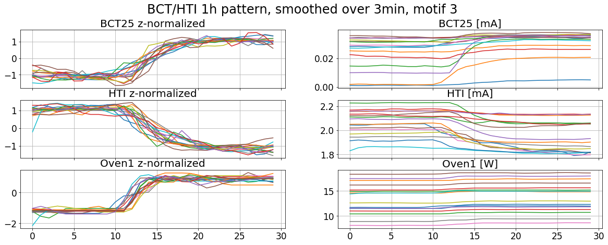

This document provides a collection of ideas and topics for the analysis of the Linac3 Ion Source from a ML viewpoint. I will try to collect descriptions and links to interesting papers and summarize the results I had when trying out some of them.

## Clustering

Given a collection of data points, clustering is to group together points that are similar under some kind of similarity metric. Usually, this is an unsupervised technique, meaning that no reference labels are known. There exist a variety of different algorithms, and each algorithm can produce very different results on the same set of data. Therefore it is crucial to somehow evaluate the results.

For Linac3 we performed a Clustering Analysis with the goal, to see, if certain settings of the source would lead to a stable beam current. For the resulting report please contact Detlef Küchler (CERN BE-ABP-HSL).

The clustering algorithm we used is called _Optigrid_ and is described in the paper "Optimal Grid-Clustering: Towards Breaking the Curse of Dimensionality in High-Dimensional Clustering" by Alexander Hinneburg and Daniel A. Keim. [@Hinneburg:OptimalGridClustering]

## Matrix Profile

The Matrix Profile is a tool for efficient motif discovery in time series, i.e. for discovery of repeated or "conserved" patterns. It can also be used to find time series discords, i.e. anomalies. A large number of papers was published by the same working group, you can find the projects website here [@Keogh:UCRMatrixProfile]. For a good introduction with example applications read the first paper [@Yeh:MatrixProfileI].

### What is the Matrix Profile?

First, let's understand what a subsequence is. Consider a time series $T=T_1 \dots T_n,\quad T_i\in\mathbb{R}$ of length $n$, and fix a number $m < n$ (typically $m \ll n$). Now, a subsequence of length $m$ starting at $i$ is the continuous block $T_i \dots T_{i+m}$. By sliding a window of size $m$ over $T$ we can get all $n-m+1$ subsequences of length $m$.

Now, we can define the distance between two subsequences. The most obvious choice is the euclidean distance $dist(Q, T) = \sqrt{\left(Q_1 - T_1\right)^2+\dots+\left(Q_m-T_m\right)^2}$. However, for the matrix profile we work with the so called _z-normalized_ euclidean distance. It is the euclidean distance of the z-normalized subsequences, i.e. we subtract the mean of the subsequence and divide the difference by its standard deviation, and only then take the elidean distance. By this we rescale all subsequences to make them more compareable. Note that under some circumstances this might be undesirable, for example when search for motifs in the call of a bird where the pitch could be relevant, and not only the shape of a signal.

The Matrix Profile $P$ is a meta time series, that for every subsequence stores the smallest distance to some other subsequence. Furthermore, the Matrix Profile Indices $I$ is another meta time series, that for every subsequence stores the starting index of the subsequence, that has the smallest distance to it. If you imagine the subsequences being points in a $m$ dimensional Space, then the matrix profile index of a subsequence is the starting index of the closest neighbor and the matrix profile value is the distance to the closest neighbor. 

So, what does this tell us? In the example above you can see a visualization of the Matrix Profile for the [Steamgen Dataset](https://www.cs.ucr.edu/~eamonn/iSAX/steamgen.dat). In the upper plot you see the data set, and in the lower plot you see a plot of the Matrix Profile. The two dashed lines represent the lowest values in the Matrix Profile. This means the two subsequences that start at each of these lines have a very small (the smallest) distance from each other, hence they are very similar. This means, that by visually inspecting the Matrix Profile we can immediately see the most repeated pattern. There are various other things to discover and better overview can be found on the UCR page [@Keogh:UCRMatrixProfile]. There exist also generalizations to more dimensions, see [@Yeh:MatrixProfileVI].

There exists a very good Python library called _stumpy_ for computing the Matrix Profile that also has very good support by the author. The Github page can be found here [@Law:stumpy].

### How could the MP be used?

As described above, the MP profile is a tool that can help to discover repeating or anomalous patterns in time series data. Hence we can aim to apply it to any of the many time series produced by the source.

1. Patterns in the BCT currents for prediction: One could try to discover repeating patterns in the BCT currents and see if they can be used to predict the future development. For example if a pattern indicates a degradation of the current in the near future, it could be used to alert the operators in time. There exists also a real time version of the MP, where it gets updated with every arriving data point. For this the SDTS algorithm [@Yeh:MatrixProfileIV] built on top of the MP could be interesting.
2. Pattern in the BCT current for analysis: Likewise, one could try to link patterns in the BCT with patterns/actions of other parameters. For example, often times a slow increase of the HT current leads to a slow degradation of the BCT current.
3. Motifs of different parameter combinations shifted in time: When computing the multidimensional matrix profile, to see if there are motifs in more than on dimension, one could shift one of the time series in time, to see for example how a change of the gas voltage affects the current in one hour.
4. Meta time series: Instead of looking at the original time series, one could try to look for motifs or discords in a rolling window time series. For example, one could calculate the standard deviation in one hour windows over the BCT25 current and look for repeated patterns there, to maybe find motifs that will indicate a future unstable period.

### Difficulties

The MP is built under the assumption, that repeated patterns or motifs are an effect of a regular event in the generating process. One example from the Papers is Seismology. There the time series is the recording of a Seismograph, which can have very long periods of "random" data, where nothing happens. However, an earthquake would show up with a very distinctive shape.

In our case however, the BCT signals are mostly flat with oscillations (see the two images above), hence motif discovery with z-normalized subsequences is very insufficient. If you have two flat signals with a lot of added noise, their z-normalized euclidean distance will be very large, even if one might expect it to be small because visually they are very similar. There are some ideas to mitigate the problem [@Paepe:EliminatingNoiseMatrix], but I didn't get any satisfying results.

### Results

Instead of trying to use a matrix profile with removed noise I flattened the signal over some minutes and found several links of parameter changes to BCT current. The results where achieved using the MSTOMP algorithm [@Yeh:MatrixProfileVI], a multi dimensional generalisation of the matrix profile calculation.

A rising HTI often coincides with a degrading BCT25 current, so this seems to confirm this theory. However it is not a proof that an opposite effect (e.g. rising HTI and rising BCT current) doesn't also exist. But we didn't observe it in the time frame we considered (August and September 2016).

The reverse can also be seen. Drops of the HTI correlate with jumps in the BCT25 current.

One possible explanation we explored is that the behavior in the second image can often time be achieved by increasing the Oven Power. This can be seen in this image.

However, it appears that there are cases where the oven remains unchanged. Further invastigation is necessary, but it could be that the power of Oven 2 was increased, as this is only the data for Oven 1.

We could also see that an increase of the oven power is often accompanied with a decrease of the gas voltage.

We didn't see any meaningful motifs when jointly looking at the Bias Disc Voltage and the BCT25 current.

## Discretization

One problem of using the data from CALS/NXCALS is that for all setting only acquisitions are logged. This means, that we typically don't know the exact values a setting was changed to, see the figure below for example. It shows one day (05.11.2018) of Oven1 power acquisition from NXCALS, where only one data point every five minutes is logged. From the logbook we can learn that at 14:00 the Oven1 Power was set to 12.0W, however on the plot we can see some oscillations (The times in the plot are UTC, so you have to count +2h).

The same occurs with other settings, and raises the problem that we cannot directly say when a change of a certain setting happened. So I tried to discretize the raw acquisition values and get back the true setting where possible. The main assumption I had to make is that a setting remained constant over time, unless somebody changes it. This appears reasonable in most cases, but in some extreme cases some information might be lost (see below).

Under this assumption we can model a setting as a step function [@Weisstein:StepFunction] with added noise, and the problem is to find the step function. I will call the step function _discretization_, because we separate our time series into discrete states of a fixed setting.

There are several techniques that could be used to solve such a problem, and we will discuss some of them [below](#change-point-detection) in more detail for a different use case. For this use case I combined a simple rolling window approach with a decision tree regressor. Some results can be seen below.

As one can see, the discrete approximation, our attempt at finding the true step function, follows the acquisition signal very closely and most changes are modeled correctly. This can also be seen when comparing the results with entries in the elogbook (especially for the oven, since here most changes are noted in the logbook). As can be seen in the figures, during some periods no discrete approximation is plotted. This is the case when the source was off (BCT05 current 0A), because the method does not work well when there are sections with a non-step function like signal as during an oven restart, so I cut them out.

### Explanation

As described above, the process involves using a Decision Tree Regressor. A decision tree partitions the input data by sequentially applying if-then-else rules. It can be thought of as a directed graph, were every node is one of these rules. End nodes, so called leaves, that return the class the input is belonging to. Training a decision tree means finding an optimal set of rules, that explains the training data as good as possible. [TODO: Add reference]. Decision trees are a supervised learning method, meaning that for each training input a output class is specified, and the algorithm tries to learn this relationship.

Decision trees can be used for regression. If you want to regress a function $\mathbb R^n \to \mathbb R; \quad (x_1, \dots, x_n) \mapsto y$ you pass $(x_1, \dots, x_n)$ as input and $y$ as the desired class. In the case of an one dimensional function for example, a decision tree classifier could lern that for $x>=5$ and $x<=10$ it should output $y=5$. So, by the nature of a decision tree, the regression result is a step function, that looks like the result as much as possible. 

One very common problem with decision trees is over fitting. If they are allowed to grow too much, they are not regressing any more, but copying. For example suppose that all your input data points are the natural numbers. By building a tree with the rules $(x >= 0.5, x <1.5)$, $(x >= 1.5, x <2.5)$, $(x >= 2.5, x <3.5)$, ... the resulting regressor could perfectly replicate the input function, but it would learn all small oscillations, what is not what we are typically interested in. However, one thing that can be controlled is how many leaf nodes the tree can have, i.e. in the 1D case into how many intervals the real axis can be split at most.

In our case it would hence be useful to know how many discrete levels, or number of constant segments, the function we want to model consist of. Then, we could regress it using a tree with this maximum of leaf node, because by minimizing the error (i.e. difference from the original function) it would find the best stepwise approximation to the input data without over-fitting.

#### Finding the number of constant segments

## Change Point Detection

## Suffix arrays

## References
